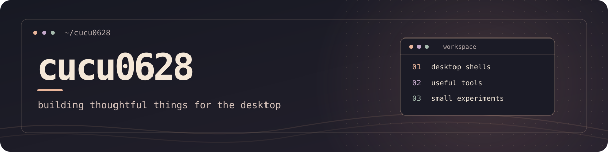

  

  I build Linux desktop experiences, useful tools, and the occasional playful experiment. 
  Lately, I've been exploring what a desktop can feel like with <strong>Quickshell</strong>, <strong>QML</strong>, and <strong>Hyprland</strong>.

  <a href="https://github.com/cucu0628?tab=repositories">Explore my projects</a> ·
  <a href="https://github.com/cucu0628/vellum_shell">See what I'm building now</a>

## Selected projects

| Project | A little about it |
| :-- | :-- |
| **[Vellum Shell](https://github.com/cucu0628/vellum_shell)** | An ink-inspired desktop shell for Hyprland, with a launcher, notifications, media dashboard, and live appearance controls. |
| **[Hibiki](https://github.com/cucu0628/Hibiki)** | A Qt 6 music player for Linux with a local library, playlist downloads, and MPRIS integration. |
| **[Deskmate](https://github.com/cucu0628/omarchy-deskmate)** | An animated Omarchy desktop companion that wanders around, reacts to commands, and can travel between monitors. |
| **[Varnished Horizon](https://github.com/cucu0628/varnished-horizon)** | A warm, painterly dark theme for Omarchy. |

## Things I work with

`QML` · `C++ / Qt` · `Rust` · `Python` · `TypeScript` · `Bash` · `Linux`

Usually somewhere between a terminal, a music player, and another desktop tweak.

