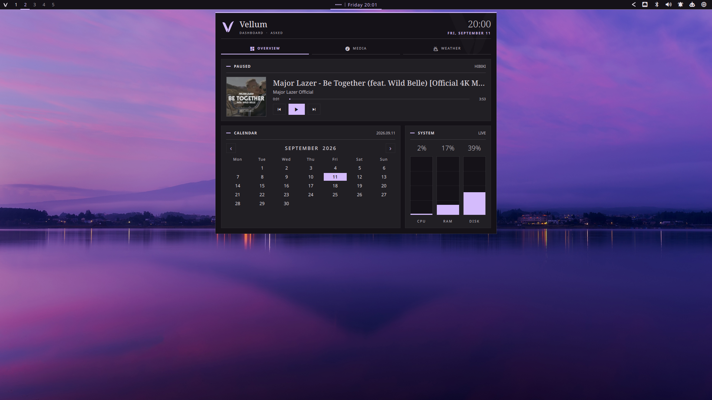

  

### Hi, I'm cucu 👋

I like making Linux feel personal — from the shell around my windows to the music player inside them. I spend most of my time building with **QML, Qt, Rust, and Hyprland**.

 

01 / CURRENTLY BUILDING

## [Vellum Shell](https://github.com/cucu0628/vellum_shell)

An ink-inspired desktop shell for **Hyprland + Quickshell**. It brings the bar, launcher, notifications, media, settings, and appearance controls together in one place.

QML · Rust · Hyprland &nbsp;·&nbsp; [Explore the project →](https://github.com/cucu0628/vellum_shell)

 

02 / OTHER THINGS I'VE MADE

## More from my workspace

### 🎧 [Hibiki](https://github.com/cucu0628/Hibiki)

A Qt 6 music player with a local library and MPRIS support. It picks up Vellum Shell's theme when they're running together.

### ✨ [Deskmate](https://github.com/cucu0628/omarchy-deskmate)

A tiny animated companion for Omarchy that wanders, can react to failed commands, and can be dragged between monitors.

### 🌄 [Varnished Horizon](https://github.com/cucu0628/varnished-horizon)

A warm, painterly dark theme for Omarchy, inspired by landscape paintings.

 

<a href="https://github.com/cucu0628?tab=repositories">See all repositories →</a>

